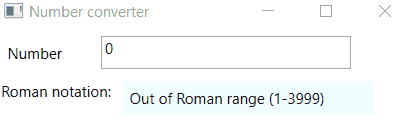

# Exercises - Chapter 6 - Unit Testing

## Exercise 1
Make an application that converts numbers to there Roman notation:

You can type a number in a *TextBox*. With each character you type the Roman notation is calculated and shown. 
The application achieves this using two-way binding and a custom converter (*RomanNumberConverter*). 
The XAML and the databinding is already implemented. 

What you need to do is to implement the *Convert* method of the *RomanNumberConverter* and write the necessary unit tests that verifies the implementation of the *Convert* method. 

Complete the *RomanNumberConverterTests* class (in the test project) by implementing the following tests:
* Convert_ShouldThrowArgumentExceptionWhenValueIsNotAString
     * The code should throw an *ArgumentException* when the source object is not of type *string*. The converter should only be used in bindings for a string property (e.g. the *Text* property of a *TextBlock*). 
     * Use an instance of *object* (*new object()*) to represent a value of a non-string type.
     * When you test the *Convert* method, you can pass *null* for the last 3 parameters.
     * Also test if the *Message* of the *ArgumentException* contains the word "string" or "String" (case insensitive).
* Convert_ShouldReturnInvalidNumberWhenTheValueCannotBeParsedAsAnInteger
     * The code should try to parse the value to an integer. When is does not succeed, the converted value should be the string *"Invalid number"*.  
     * Define some test cases (3 or more) to test different invalid inputs. 
     * There should be one test case for a value that does not contain any digits.
     * There should be one test case for an empty string.
* Convert_ShouldReturnOutOfRangeWhenTheValueIsNotBetweeOneAnd3999
     * It is only possible to covert numbers between 1 and 3999. When the number to convert is out of bounds, the converted value should be the string *"Out of Roman range (1-3999)"*. 
     * Define some test cases (2 or more). At least one test case for a value that is too small and at least one test case for a value that is too big.
* Convert_ShouldCorrectlyConvertValidNumbers
     * Define some test castes (4 or more) to test a valid conversion. 
     * You can use the following (recursive) algorithm to implement the conversion:
          * If *number >= 1000* the result is *M* followed by the conversion of *number - 1000*. 
          * If *number >= 900* the result is *CM* followed by the conversion of *number - 900*. 
          * If *number >= 500* the result is *D* followed by the conversion of *number - 500*. 
          * If *number >= 400* the result is *CD* followed by the conversion of *number - 400*. 
          * If *number >= 100* the result is *C* followed by the conversion of *number - 1000*. 
          * If *number >= 90* the result is *XC* followed by the conversion of *number - 90*. 
          * If *number >= 50* the result is *L* followed by the conversion of *number - 50*. 
          * If *number >= 40* the result is *XL* followed by the conversion of *number - 40*. 
          * If *number >= 10* the result is *X* followed by the conversion of *number - 10*. 
          * If *number >= 9* the result is *IX* followed by the conversion of *number - 9*. 
          * If *number >= 5* the result is *V* followed by the conversion of *number - 5*. 
          * If *number >= 4* the result is *IV* followed by the conversion of *number - 4*. 
          * If *number >= 1* the result is *I* followed by the conversion of *number - 1*.

Write the test first and then try to make it green by altering the production code.
Use a setup method.

## Exercise 2
Fizz buzz is a group word game for children to teach them about division. 
Players take turns to count incrementally, replacing any number divisible by three (the fizz factor) with the word **Fizz**, 
and any number divisible by five (the buzz factor) with the word **Buzz**. 
If the number is divisible by both three and five it should be replaced with the word **FizzBuzz**.

For example, a typical round of fizz buzz would start as follows:

*1 2 Fizz 4 Buzz Fizz 7 8 Fizz Buzz 11 Fizz 13 14 FizzBuzz 16 17 Fizz 19 Buzz Fizz 22 23 Fizz Buzz 26 Fizz 28 29 FizzBuzz 31 32 Fizz 34 Buzz Fizz ...*

The FizzBuzz application you are building can be used to generate the numbers of a FizzBuzz game up until a certain last number (e.g. 100).
The user can also alter the Fizz factor, the Buzz factor and the last number. 

The presentation layer (UI) of the application is already in place. 
It uses a class “FizzBuzzService” in the business layer that can generate the text.

Complete the FizzBuzzService tests (in the test project) and make sure the FizzBuzzService class works correctly.
Complete the following tests:
* ReturnsCorrectFizzBuzzTextWhenParametersAreValid
* ThrowsValidationExceptionWhenFizzFactorIsNotInRange (Minimum = 2, Maximum = 10 -> See constants in *FizzBussService.cs*)
* ThrowsValidationExceptionWhenBuzzFactorIsNotInRange (Minimum = 2, Maximum = 10 -> See constants in *FizzBussService.cs*)
* ThrowsValidationExceptionWhenLastNumberIsNotInRange (Minimum = 1, Maximum = 250 -> See constants in *FizzBussService.cs*)

Make sure to test the following cases in the first test:

| Fizz factor | Buzz factor | Last number | Expected result                                                       |
|-------------|-------------|-------------|-----------------------------------------------------------------------|
| 2           | 3           | 1           | 1                                                                     |
| 4           | 5           | 4           | 1 2 3 Fizz                                                            |
| 5           | 4           | 4           | 1 2 3 Buzz                                                            |
| 2           | 3           | 15          | 1 Fizz Buzz Fizz 5 FizzBuzz 7 Fizz Buzz Fizz 11 FizzBuzz 13 Fizz Buzz |
| 2           | 2           | 4           | 1 FizzBuzz 3 FizzBuzz                                                 |

Write the test first and then try to make it green by altering the production code.
The names of the tests should be enough info to know what they should do.
Use a setup method.

The tests in the project **Guts.Tests** will check your solution. **Do not modify these tests!**